# 🧜‍♀️ Mermaid Diagram Examples

Smart Tree can generate beautiful Mermaid diagrams for your directory structures! Here are examples of all available styles.

## 🗺️ Treemap Style (NEW!)

Perfect for visualizing file sizes! Numbers represent size in KB.

```bash
st -m mermaid --mermaid-style treemap scripts
```



```mermaid
%%{init: {'theme':'dark'}}%%
treemap-beta
    "📁 scripts"
        "📝 README.md": 2
        "📄 build-and-install.sh": 1
        "📄 install.sh": 7
        "📄 kill-stuck-st.sh": 1
        "📄 manage.sh": 25
        "📄 send-to-claude.sh": 2
        "📄 shell-functions.sh": 3
        "📄 update-dxt.sh": 9
```

## 📊 Flowchart Style (Default)

Traditional connected nodes showing directory structure.

```bash
st -m mermaid  # or st -m mermaid --mermaid-style flowchart
```



```mermaid
graph TD
    root["📁 project"]
    node_1["📁 src"]
    node_2["📄 main.rs<br/>34 KB"]
    node_3["📁 utils"]
    node_4["📄 helpers.rs<br/>12 KB"]
    
    root --> node_1
    node_1 --> node_2
    node_1 --> node_3
    node_3 --> node_4
    
    style root fill:#ff9800,stroke:#e65100,stroke-width:4px,color:#fff
    style node_1 fill:#e3f2fd,stroke:#1976d2,stroke-width:2px
    style node_2 fill:#dcedc8,stroke:#689f38
    style node_3 fill:#e3f2fd,stroke:#1976d2,stroke-width:2px
    style node_4 fill:#dcedc8,stroke:#689f38
```

## 🧠 Mindmap Style

Great for visualizing project structure as a mind map.

```bash
st -m mermaid --mermaid-style mindmap
```



```mermaid
mindmap
  root((📁 project))
    📁 src
      🦀 main.rs
      🦀 lib.rs
      📁 utils
        🦀 helpers.rs
    📁 docs
      📝 README.md
      📝 API.md
    ⚙️ Cargo.toml
```

## 🌿 Git Graph Style

Shows directory structure like a git branch history.

```bash
st -m mermaid --mermaid-style gitgraph
```


## 💡 Tips

1. **File Sizes**: Treemap and flowchart styles show file sizes
2. **Emojis**: Use `--no-emoji` if your renderer has issues with emojis
3. **Depth Control**: Use `--depth N` to limit diagram complexity
4. **Large Projects**: Treemap is best for visualizing size distribution

## 🎨 When to Use Each Style

| Style | Best For | Shows Sizes | Visual Type |
|-------|----------|-------------|-------------|
| **Treemap** | Size analysis | ✅ Yes (in KB) | Hierarchical boxes |
| **Flowchart** | Structure overview | ✅ Yes | Connected nodes |
| **Mindmap** | Conceptual view | ❌ No | Radial tree |
| **GitGraph** | Development flow | ❌ No | Branch-like |

## 🚀 Pro Tips

- **GitHub/GitLab**: These platforms render mermaid diagrams automatically!
- **VS Code**: Install a mermaid preview extension to see diagrams while editing
- **Documentation**: Perfect for README files and technical docs
- **Size Analysis**: Treemap quickly shows which directories are largest

---

*Brought to you by Smart Tree - Making directory visualization beautiful! 🌳✨* 