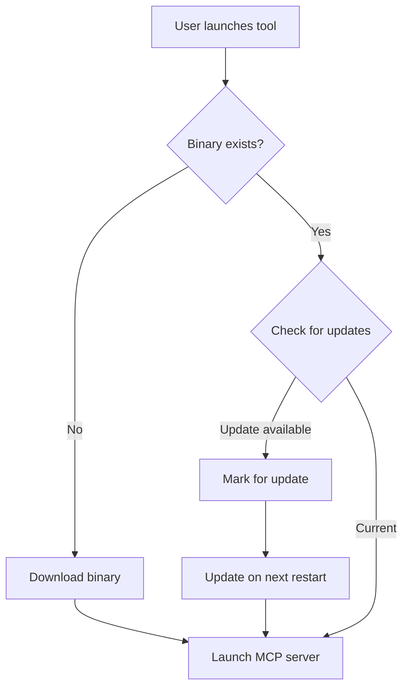

# Smart Tree Universal - Auto-Updating Binary DXT Example

This example demonstrates best practices for creating DXT packages that distribute native binaries with automatic updates.

## What This Example Shows

- ✅ **Cross-platform binary distribution** (Windows, macOS Intel/ARM, Linux)
- ✅ **Automatic updates** with version checking
- ✅ **Graceful error handling** and fallbacks
- ✅ **MCP server integration** for native tools
- ✅ **Professional package structure**
- 🌟 **AI Optimization techniques** that save 90% on token costs
- 🗜️ **Smart compression** with transparent zlib integration
- 🔢 **Hex format innovations** for compact data representation

## Why This Pattern?

Many powerful developer tools are written in compiled languages (Rust, Go, C++) for performance. This example shows how to:

1. Package these tools for Claude Desktop
2. Handle platform-specific binaries automatically
3. Keep tools updated without user intervention
4. Provide a seamless experience across all platforms

## Key Features

### 🔄 Auto-Update System
- Non-blocking update checks on startup
- Version comparison with GitHub releases
- Automatic installation on next restart
- Network failure resilience

### 📦 Smart Binary Management
- Platform detection (OS and architecture)
- Compressed archive extraction (.tar.gz, .zip)
- Executable permissions handling
- Binary caching to avoid re-downloads

### 🛡️ Security First
- HTTPS-only downloads
- Configurable path restrictions
- Minimal permissions required
- No arbitrary code execution

### 💎 AI Optimization Innovations
- **Hex Format**: Reduces output by 33% while maintaining all information
- **Compression**: 90% token reduction with transparent zlib
- **AI Tags**: Special markers (TREE_HEX_V1, END_AI) for perfect parsing
- **Digest Mode**: One-line directory fingerprints for quick analysis

📊 **Real Impact**: Analyzing a 2.5MB directory tree costs $3.13 with traditional format vs $0.31 with Smart Tree's AI mode!

## Quick Start

```bash
# 1. Use the setup wizard
./setup-new-dxt.sh

# 2. Follow the prompts to configure your tool

# 3. Build your package
./build-dxt.sh

# 4. Test in Claude Desktop
```

## File Structure

```
├── manifest.json           # DXT manifest with tool definitions
├── server/
│   ├── index.js           # Entry point with auto-update logic
│   ├── install.js         # Binary download and platform detection
│   └── package.json       # Node.js configuration
├── icon.png               # Your tool's icon (512x512)
├── build-dxt.sh          # Build script
├── setup-new-dxt.sh      # Interactive setup wizard
└── IMPLEMENTATION_GUIDE.md # Detailed implementation guide
```

## The Auto-Update Flow



## Adapting for Your Tool

1. **Run the setup wizard**: `./setup-new-dxt.sh`
2. **Update manifest.json**: Define your MCP tools
3. **Set up GitHub releases**: Use consistent naming
4. **Test locally**: Build and install the DXT
5. **Share with the community**: Submit your tool!

## Platform Support

| Platform | Architecture | Binary Format | Archive Type |
|----------|--------------|---------------|--------------|
| macOS | Apple Silicon | `tool-aarch64-apple-darwin` | `.tar.gz` |
| macOS | Intel | `tool-x86_64-apple-darwin` | `.tar.gz` |
| Linux | x86_64 | `tool-x86_64-unknown-linux-gnu` | `.tar.gz` |
| Windows | x86_64 | `tool-x86_64-pc-windows-msvc.exe` | `.zip` |

## Contributing

This example is actively maintained. If you find improvements or have suggestions:

1. Share your enhancements
2. Submit PRs with new features
3. Help others in the community

## Resources

- [Full Implementation Guide](IMPLEMENTATION_GUIDE.md)
- [Template Checklist](TEMPLATE.md)
- [Smart Tree Source](https://github.com/8b-is/smart-tree)
- [DXT Documentation](https://github.com/anthropics/dxt)

## License

MIT - Use this template freely for your own DXT packages!

---

*Created by the Smart Tree team with 💖 and a sprinkle of Trisha's sparkles ✨*